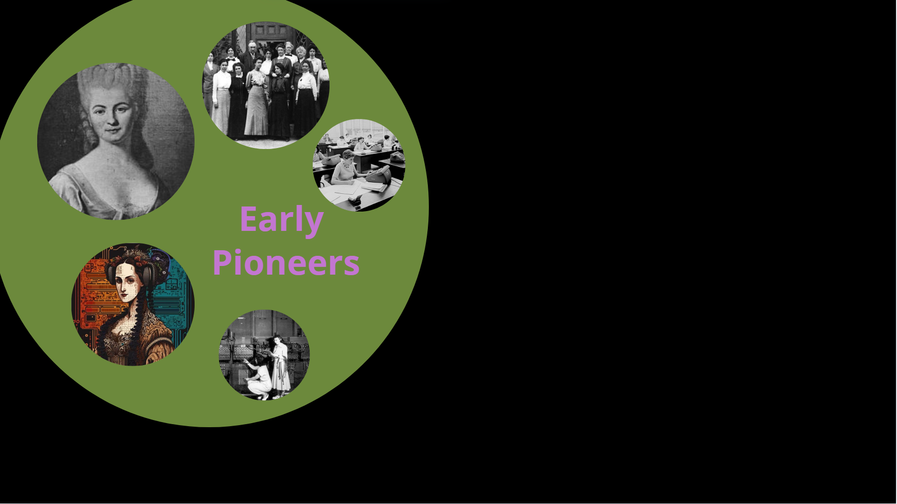
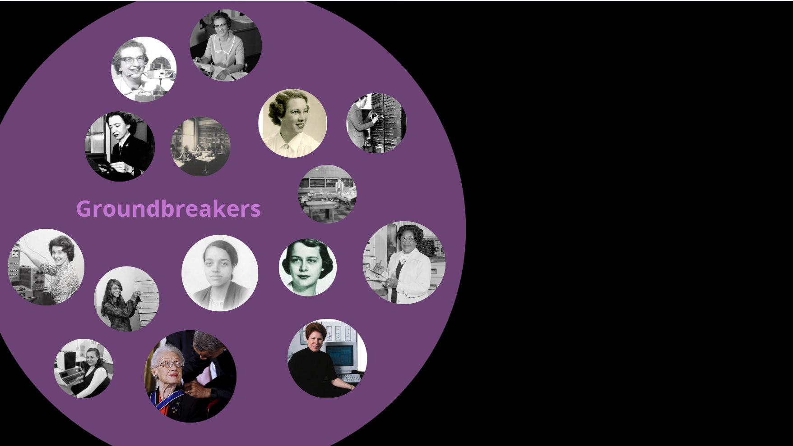

# Links to Resources about Women in tech

## General References:

The story of how women started and built the field of computing has been told many times, yet is not know be too many.  To learn more, go to the [General References](./References/General.md) page.

## Early Pioneers

 The early pioneers to computer programming included Nicole-Reine Etable de la Brière Lepaute, Ada Lavelace (Lady Lovelace), The Harvard Computers, Mathematical Tables Project, and The Philadelphia Computing Section among many others.  Many of these women's names have been lost to history.  To learn more about them go to the [Early Pioneer's](./References/earlyPionneers.md) page.

 

## Groundbreakers

Women didn't just contribute to the early computing in meaningful ways, WE built it. These Early women leaders guided the development of most things we think of today when it comes to modern computing.  Check out more links at the [Groundbreaker's](./References/Groundbreakers.md)]

 

## Entreprenuers

Women also had a hand in the early tech industry.  Check out the [Entreprenuers](./References/Entreprenuers.md) page for more details.

 

 ## Data

 Women also founded Data Science and have made many significant contributions.  More details on the [Data](./References/Data.md) page.

 

## UI/UX

Women initialized the modern UIs that we know today.  Find out more on the [UI/UX](./References/UiUx.md) page.

 