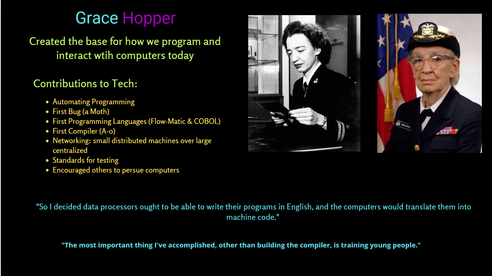
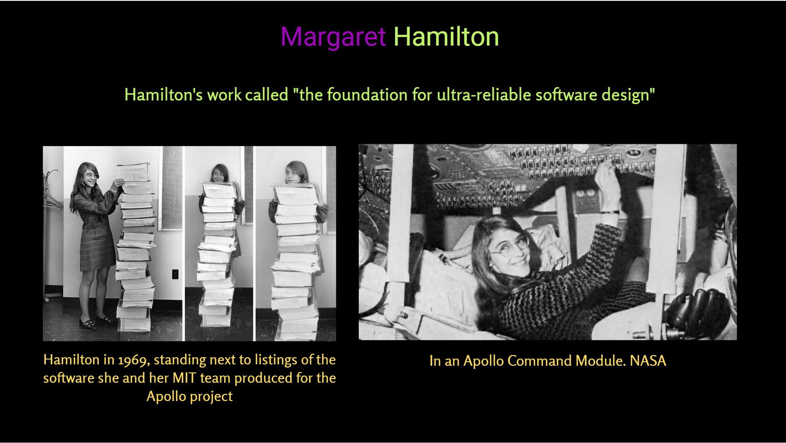

## We Built I.T. Presentation

These are the slides and notes from the First I.T. Girls meetup on March, 19th, 2025

### Slide 1

- There are so many women that contributed that to tell the whole story, we would need to keep you here until 2am!  

- Women didn't just contribute to the early computing in meaningful ways, WE built it.

- Early women leaders guided the development of most things we think of today when it comes to modern computing.

- We are the ones who thought-up, designed and implemented the basic tenants of software, data, guis, personal computers, and more.  

- This influence started long before computers were even around. 

### Slide 2

- Don't have time to cover everyone from this era.  

- Women contributed to all aspect of the growing computer business and most of the early concepts we still use today.

- Even these names are not all the known women that contributed.  In addition, many of the women's names have been lost to history.

### Slide 3

- We've divided up the awesomeness into 5 categories, Early Pioneers, Groundbreakers, Data, Entrprenuers adn UI/UX and picked some representative samples.  

- There are so many women that contributed that to tell the whole story, we would need to keep you here until 2am!  

- Women didn't just contribute to the early computing in meaningful ways, WE built it.

- Early women leaders guided the development of most things we think of today when it comes to modern computing.

- We are the ones who thought-up, designed and implemented the basic tenants of software, data, guis, personal computers, and more.  

- This influence started long before computers were even around.

### Slide 4

- The first group are the early pioneers.  These women did the groundwork for programming long before mechanical computers even existed.

- There are so many women that contributed that to tell the whole story, we would need to keep you here until 2am!  

- Women didn't just contribute to the early computing in meaningful ways, WE built it.

- Early women leaders guided the development of most things we think of today when it comes to modern computing.

- We are the ones who thought-up, designed and implemented the basic tenants of software, data, guis, personal computers, and more.  

- This influence started long before computers were even around.  

### Slide 5

- Decades before the first computer as we may think of it, women were an intregal part of computing.  

- Starting with calcluating the prediction of Haley's commet in 1753, educated women were used to make calculations.

- Moving to  1843 when Ada Lovelace worked with Charles Babbage to concepulaized many of the modern programing principals we use today.

- In th late 19th and early 20th century, it was common for women to work as calculators, not just doing calculations by hand, but inventing methods to improve effieceny of these calculations.  Women worked doing calculations for NASA by hand until 1975.   

### Slide 6

- Helped  do the calucalations for predicting Haley's commet

- Not acknowledged in the book, Théorie du mouvement des comètes. 

- Allegedly for Alexis Clairautto to please another woman.

- She did get more work, the French government had her calculate the path of the solar eclipse in 1764.

- The methods developed have been used by successive human computing teams.

- A crater on the moon has been named in honour of Lepaute

- Born in the Palais du Luxembourg in Paris 

-Married Jean-Andre Lepaute, a royal clockmaker

-She helped with the calculations for her husband’s clocks

### Slide 7

- First computer programmer

-Envisioned Charle Babbage’s machine to do more than simple calculations
handle letters and symbols
perform more complicated tasks

- Worked with Charles Babbage, whom is considered the father of the modern computer.

- Was asked to translate a letter from ??? and in translating this letter added more footnotes than there was letter to convey her ideas and calculations

- Suggested binary storage to Babbage as opposed to the decimal system he was trying
Developed a lot of the modern concepts in computer design and programming
 memory, central processor, switch register, program library, FOR loops, indexing, comments, program trace, coder, keypuncher, analysis of algorithms

-Had 3 childen, loved music, horses and had a happy marriage

### Slide 8

- With the expansion of railroad tracks and telegraphs from the civil war, the need grew for more computers due to the expansion of weather data and surveying after the war, the government was overwhelmed with information coded into telgraphs.  This allowed women to break into this kind of work.  

- Late 1800s - mid 1900s, women who were interested in science were often hired as human calculators.

- The women taking these positions were everyday women, from ordinary families, without fancy educations.  Programming became a working-class job.  

- Analogous to the need for programmers from 2010-2020 and the inception of boot camps.  Also allowing more women to break into tech.

- The examples of women computer are numorous.  We're going to talk about 3 groups: The Harvard Computers, Mathematical Tables Project, The Philadelphia Computing Section

- https://cmsw.mit.edu/age-female-computers-francesca-schembri/

- On the other side of the Atlantic, the Second Industrial Revolution was sweeping across the United States, bringing with it new forms of communication and transportation, and, by consequence, the demand for more computers. The telegraph wires and train tracks followed the soldiers of the Civil War as they marched south and west. When the collection of weather data and surveying resumed in the years following the war, the U.S. government was overwhelmed with information coded into telegraphs.
In 1870, the Army Signal Corps, the U.S. Naval Observatory, and the Coast Survey began hiring large staffs of computers to perform calculations on the incoming data and prepare it for distribution. Women began breaking into these computing rooms in the two decades following the Civil War. Unlike their predecessors Lovelace and Lepaute, these American female computers did not hail from wealthy families, nor did they have world-class educations or affluent husbands and friends.

- The results of the numerical integration formulae were then entered into ballistics table for every conceivable firing angle, distance, velocity, and weather condition, and sent directly to soldiers at the front. As new weapons rolled off assembly lines at a breakneck pace, new ballistic tables needed to be computed quickly. Accuracy in ballistics firing and bomb dropping in a variety of conditions across Europe was critical to the American war effort. 

### Slide 9

- Astrophotography become the prefered method for studing  celestial bodies.  However, there was an overwhelming amount of data to analyze.  

- Edward Charles Pickering: Not finding his male assistent competitent, he fired him and hired his maid, Williamina Fleming.

- Williamina Fleming hired women as assistants to work on every part of collecting and analyzing the data.

- Pickering thought women were better workers and more competent.  

- Picker also liked that he could hire women for a lot less $$ than men.

- These women worked super hard to collect this data all night long.  

- They worked 6 days per week.  The women typically earned: 25 to 30 cents/hour ($10.50 to $12/week or $500-600)

- For context, this was about half of what male assistants at the observatory earned for similar work

-Women in software development today earn approximately 90-95% of what men earn for the same roles

- Roughly equivalent to what elementary school teachers made at the time

- They invented and refined techniques in data collection and math to be more effiecient

- Even with all of this, they were not paid well for their work and not recognized individually for their work.  

References:
https://www.smithsonianmag.com/history/the-women-who-mapped-the-universe-and-still-couldnt-get-any-respect-9287444/

### Slide 10

- The Math Tables Project (MTP) of the New Deal’s Works Projects Administration (WPA) helped put people to work by having them serve as (human) computers constructing tables of mathematical functions which were needed for hand computation.

- 1943. Gertrude Blanch led the Mathematical Tables Project group from 1938 to 1948. Recruited from a math class taught by the director becasue even with a PhD in Math, couldn't find a job.  She took the class to keep up her skills.

- During World War II, the project operated as a major computing office for the U.S. government and did calculations for the Office of Scientific Research and Development, the Army, the Navy, the Manhattan Project and other institutions.[26]

- Most of the actual computations were done by human computers paid for by the Works Projects Administration(WPA). 

- Produced High Quality results, but was not given respect because of the stigma associated with relief work.

- The project grew to be the largest computing organization in the world, with a staff of some 450 persons at its high point.

 - A major computing office for the U.S. Government 

- Worked on:
    - Research Projects
        - Army, Navy, and other military
        - The Manhattan Project: a top-secret World War II program to develop the first atomic bombs
        - Led by Gertrude Blanch from 1938 - 1948

- Based out of New York until 1948  
~25 members of the group moved to Washington, D.C., to become the Computation Laboratory of the National Bureau of Standards, now the National Institute of Standards and Technology
   
References:
https://www.ladyscience.com/remembering-the-women-of-the-mtp/no54

### Slide 11

~100 women who worked as part of a secret U.S. Army project during WWII. 
Calculated the ballistics table for every  firing angle, distance, velocity, and weather condition for firing and bomb dropping
Sent Calculations directly to soldiers on the front-lines of the war

- Repeated often because new weapons were being continuously released 

- Computing a 1-minute bomb trajectory computations took 40 hours of labor on the desktop machines, or 15 minutes on the Differential Analyzer.

- Thought of as “clerical workers” and not given credit. 

= Mitch Marcus, explains that the analyzer was difficult to use “Setting up a problem involves putting gears of the right size together, and once you set up a problem on a differential analyzer, it’s very hard to change it,” he explains. “You program it once and get it into an alignment, but if the wheels slip then you’ve got big problems.”

- Pay considered good for it’s time.  Earned  $1250 to $2000 annually, considered good for it’s time. Really? $17,230 - $35,461.24 by 2024 standards

- Formed a close bond with mainly women in the company

- Significant Contributions to WWII effort

References:
https://www.researchgate.net/publication/270904334_The_Secret_Women_of_the_Philadelphia_Computing_Section

Notes: Among the mathematical techniques used routinely by Jennings and her colleagues were these:  The Gregory-Newton interpolation formula. This is used to estimate, starting with one value of a function, its value at subsequent increments. For such finite differences, Gregory-Newton serves the same purpose as the well-known Taylor Series formula serves for infinitesimal differences, and the two formulae look quite similar.  Inverse interpolation. This is an iterative technique for approximating the roots of a nonlinear function, f. The formula for it is developed by applying a standard interpolation method to the inverse function, f-1(0) = x.  Simpson’s Rule. This is used to estimate the integral, or area, under any plane curve. The formula for it is developed by approximating the curve with a series of parabolic arcs.  Smoothing algorithms. These are used to modify a set of collected data by reducing the chance fluctuations (“noise”) contained within it. A function can then be calculated that better fits the data, expressing its main trends.  

Songs of the Women Computers  The women of the Philadelphia Computing Section created and sang their own songs about their work. They typed up the lyrics and kept these in a notebook, even decades later. A few of the pages can be seen in the “Rosies” DVD.  To the tune of Gene Autry’s “(I’ve Got Spurs That) Jingle Jangle Jingle”  I’ve got differences that wiggle, waggle, wiggle As I go smoothing crazily along. I’ve got factors that make me wanta giggle As I inverse interpolate along. Oh, Gregory-Newton, Oh Gregory-Newton How we love your coefficients— Yes, we love them for computin’. I’ve got ranges that wiggle, waggle, wiggle And my φ’s waver crazily along. But if Hitler’s nerves begin to jiggle Then our tables can’t be very far from wrong.  To the tune of Cole Porter’s “Night and Day”  Night and Day, all I can see Are the marks on that long-winded trajectory… With its X’s and X Prime, Oh I make mistakes all of the time Whether it’s Night or Day!  Night and Day, oh what a fate Befalls us who all day have to interpolate! Oh it makes one quite a wreck To spend hour and hour to check and double check Simpson’s Rule… Night and Day!  Day and Night, what’s to become of me? Oh there’s so many columns to this darned ol’ trajectory… And its torment won't be through ’Til this war is o’er and we have NOTHING to do Day and Night… Night and Day

https://penntoday.upenn.edu/news/worlds-first-general-purpose-computer-turns-75

https://cmsw.mit.edu/age-female-computers-francesca-schembri/

Notes: The results of the numerical integration formulae were then entered into ballistics table for every conceivable firing angle, distance, velocity, and weather condition, and sent directly to soldiers at the front. As new weapons rolled off assembly lines at a breakneck pace, new ballistic tables needed to be computed quickly. Accuracy in ballistics firing and bomb dropping in a variety of conditions across Europe was critical to the American war effort. 

### Slide 12

- There are so many women that contributed that to tell the whole story, we would need to keep you here until 2am!  

- Women didn't just contribute to the early computing in meaningful ways, WE built it.

- Early women leaders guided the development of most things we think of today when it comes to modern computing.

- We are the ones who thought-up, designed and implemented the basic tenants of software, data, guis, personal computers, and more.  

- This influence started long before computers were even around.  

### Slide 13

- There are so many women that contributed that to tell the whole story, we would need to keep you here until 2am!  

- Women didn't just contribute to the early computing in meaningful ways, WE built it.

- Early women leaders guided the development of most things we think of today when it comes to modern computing.

- We are the ones who thought-up, designed and implemented the basic tenants of software, data, guis, personal computers, and more.  

- This influence started long before computers were even around.  

### Slide 14

- ENIAC, for Electronic Numerical Integrator and Computer. Its circuitry could perform 400 multiplications per second, a huge leap beyond anything previously available. Your computer can likely perform 100-500 billion!

- Called the "Sensational Six, but they actually had names: Betty Jennings, Betty Snyder, Frances Spence, Kay McNulty, Marlyn Wescoff, and Ruth Lichterman were the regularly working programmers of the ENIAC. 

- When first programming it, they were not allowed in the same room as the machine and had to learn from diagrams and interviews with the engineers.

- Became experts in how to program, troubleshoot and fix the device.

- To get programs to run, the women had move thousands of wires specific for the calculation being performed.
Once wired-up, the ENIAC could perform calculations in seconds. 

- The engineers were given praise for being able to run the calculations in seconds, but no one took into account the thousands of wires that needed to be set by hand for the calculation to run.

- Women didn't just program it, the documented it too. 
 Adele Goldstine (not one of the sensational 6)wrote the program manual for the ENIAC. 

- Yet the male engineers got all the credit!

### Slide 

- If you've heard of 1 female programmer, it was probably Grace Hopper.  But do you know what she did?

- While the Sensational 6 were doing calculations and programming the ENIAC durring WWII, there is another woman who left her posistion at Vasser College to join the Navy and help with the was effort.

    - She was originally rejected due to advanced age (34).

- After the war, she worked in the Navy Reserves after being denied active duty, again due to her advanced age (38).

    - Reached a rank of _____ and contributed to most of the concepts we attribute to modern programming such as:
    - programming in English
    - Compilers

### Slide 

- In 1948 she wrote the first assembly language

- In 1958, she taught a programming course, one of the first ever.

- An assemble language is a low-level programming language that uses mnemonics to represent machine code.  It was used for the ARC2 computer.

- PhD in Applied Mathmatics

- Worked with her husband at Birkbeck College

- Like most of the women we've highlighted, she also had children.

- co-wrote "Automatic Digital Calculators" (1953) which illustrated the 'Planning and Coding' programming style.

- Worked with her husband and a small research group to create 3 computers: ARC (Automatic Relay Computer) built with Xenia Sweeting, SEC (Simple Electronic Computer), and APE(X)C (All-purpose Electronic (Rayon) Computer)

- Her research on neural networks led to successful programs simulating ways in which animals recognise patterns and characters.

### Slide 17

- While ENIAC was being programmed, there were other women contributing to the war effort and eventually NASA and winning the space race.

- There are too many women to talk about here, so we've chosen 4 to highlight

- Considered so impactful that Lego made a set of them.

The lego figures were:
- Margaret Hamilton: led the development of software for the Apollo missions 

- Katherine Johnson: calculated and verifyied trajectories for the Mercury and Apollo programs

- Sally Ride: the first American woman in space in 1983

- Nancy Grace Roman: astronomer & one of the first female executives at NASA

- Mae Jemison: the first African-American woman in space in 1992

- Faced discrimination from not having

- were not recognized for their efforts until ___ when Baraak Obama ____ and the book/movie "Hidden Figures" highlighted some of their stories.

### Slide 18

Why is she a bad ass?
- Worked for NASA for 33 years (1953-1986)
- One of the first 3 black students to integrate West Virginia's graduate schools

- Calculated the trajectories for the first manned space missions (she double checked the computer)

- First woman to receive credit as an author of a research report (others had contributed in the past).  Coauthored 26 research reports in total.

- Got her name on the report because a male engineer wanted to leave for a new position.

- Had 3 years as a single parent after her husband passed.  

- Did not receive any national honors until 1999
- What should we learn from her?

- To be assertive
- That the hard work may take decades to be recognized (or never recognized), but that doesn't mean it wasn't impactful.

### Slide 19

- Started at NASA as a human computer.

-NASA’s First black female engineer

- Broke racial and gender barriers to become an engineer.
She needed special permission from the City of Hampton to study her engineering courses due to segregation.

- Never broke into a management position, so left engineering. 

- Even though she didn't break the glass ceiling, she continued to fight so others could.

-Spent the last 6 years of her career fighting for the hiring and promotion of women as Langley’s Federal Womens’ Program Manager.

What can we learn from her?

- To be a pioneer

- To fight for others, even at our own personal cost

References:
https://www.nasa.gov/people/mary-w-jackson-biography/

### Slide 20

- Why is she a badass?

    - She was the one engineers would ask to find the right computer for the job at hand

    - She advocated for the women in her segregated group AND white women to get promotions and better pay

    - Was a visionary in seeing that FORTRAN did not need to take their jobs if they became the experts in FORTRAN (hmm...Analogous to AI today)

- What can we learn from her?

    - To look ahead and see what talent will be needed.  

    - To advocate for others

### Slide 21

Why is she a badass?

-Led the team that wrote the in-flight software for the Apollo spacecrafts

- Pioneered engineering principles: Asynchronous execution, Priority scheduling, Error detection and recovery

- Named the term Software Engineer.  Was a joke term until a respected hardware guru explained to everyone that he agreed with the term and that building software was an engineering disapline.  

- Worked on the hardware reliability and system error detections

-Co-founded Higher Order Software with Saydean Zeldin

- 1986 founded Hamilton Technologies, Inc.  

What can we learn from her?

- Even if others don't take your  contributions seriously, you should.  

- also worked on hardware reliability and created new techniques for system error detection in hardware.

References

Hamilton's priority alarm displays interrupted the astronauts' normal displays to warn them that there was an emergency "giving the astronauts a go/no go decision (to land or not to land)".[40] Jack Garman, a NASA computer engineer in mission control, recognized the meaning of the errors that were presented to the astronauts by the priority displays and shouted, "Go, go!" and they continued.[41] Paul Curto, a senior technologist who nominated Hamilton for a NASA Space Act Award, called Hamilton's work "the foundation for ultra-reliable software design".[28]

### Slide 22

- Don't have time to cover everyone from this era.  

- Women contributed to all aspect of the growing computer business and most of the early concepts we still use today.

Personal Computers
- Mary Allen Wilkes, Adele Goldberg, Ruth Lichterman, Carol Shaw, Fran Bilas, and Kay McNulty

Early Hardware
- Betty Holberton, Beulah Henry,
Dr. Rózsa Péter,  Mary Kenneth Keller, Stephanie "Steve" Shirley's, Betty Holberton,   Margaret Fox, Jean Bartik, Grace Hopper,
Milly Koss, Gloria Gordon Bolotsky, Thelma Estrin, Frances Spence and Ruth Teitelbaum, Margaret Hamilton, Patricia "Patsy" Simmers

Word Processing
Evelyn Berezin, Merle Bachman, Suzanne Landa, Ulrike Brandi, Mary Jane Forbes, Dr. Lorinda Cherry

Programming Languages
Grace Hopper, Jean Sammet, Betty Holberton, Deborah "Debby" Castle,  Mary K. Hawes, Jean E. Sammet, and Gertrude Tierney

Compilers
Grace Hopper , Lois Haibt, Frances E. Holberton, Adele Goldberg , Jean Sammet, Frances Elizabeth Allen, Many others

Leaders & Entrepreneurs
Hamilton, Saydean Zeldin, elsie shutt , Ann Hardy, Ruth Leach Amonette, 

### Slide 23

- FORTRAN is great for computing, but does not translate to different Hardware easily

Lois Haibt was one of the key members of the original IBM FORTRAN team in the 1950s. She was the only woman on John Backus's team of 10 programmers and worked specifically on the flow analysis section of the compiler, which was crucial for program optimization.

Irene Adler worked at IBM during FORTRAN's early development and contributed to its mathematical subroutines and functions library.

Joyce Curry was part of the team at IBM that worked on early FORTRAN implementations. She helped develop some of the basic input/output operations.

Betty Holberton, while better known for her COBOL work, also contributed to early FORTRAN standards development and helped shape how the language would handle certain mathematical operations.

Evelyn Boyd Granville, while not directly on the FORTRAN development team, wrote important mathematical programs in FORTRAN for NASA in the late 1950s that helped establish the language's capabilities for scientific computing

COBOL

-  Mary K. Hawes convinced the DoD to fund the project

- Grace Hopper laughed at for suggesting that computer language be in English

- Jean Sammet chaired the original subcommittee to analyze existing languages, This Committee was tasked with designing the foundation of Cobol.

- Gertrude Tierney was part of the original subcommittee to analyze existing languages

1952 Betty Holberton
Hired as one of the first programmers at Remington Rand on the UNIVAC. Helped develop FORTRAN and COBOL
 Created the first statistical analysis software package (for UNIVAC)

Grace Hopper:
Devloped the first compiler (A-0) for COBOL and COBOL
She developed the early standard for commercial programming

### Slide 24

- Early 1960s Mary Allens Wilkes' husband part of building the hardware for the LINC computer, while she programmed it.

LINC computer  - developed from 1961-1964 and cost $43K ($370K today)

- The project relocated and she wasn't ready to move, so had one installed in her living room to finish programming it, making her the first to have a personal computer at home

Mary Allen Wilkes worked on the LINC (Laboratory Instrument Computer) in the early 1960s, which is considered by many to be the first personal computer. She wrote the operating system software for LINC and was notably the first person to have a computer in her home when she worked on LINC assembly language from her house.

Ruth Lichterman was part of the original Apple Computer team in 1976. She helped with early production and testing of the Apple I computer.

Carol Shaw worked at Atari in the late 1970s designing games and software for personal computers. While she's often recognized for her game development, she also contributed to the development of the Atari 2600's operating system.

### Slide 25

Evelyn Berezin (Redactron Corporation) created the first computerized word processor called the Data Secretary in 1971. 

Wang Word Processing System (WPS) in 1976 - Merle Bachman led the software development team and was instrumental in designing the user interface, and functionality that made Wang word processors highly successful in offices.

Ulrike Brandi and Mary Jane Forbes worked at Xerox PARC in the early 1970s, contributing to the development of Bravo - one of the first WYSIWYG (What You See Is What You Get) word processors that influenced modern software like Microsoft Word.

Dr. Lorinda Cherry worked at Bell Labs in the 1970s and developed several important text processing tools for Unix, including 'eqn' for mathematical equations and 'dc' for desk calculator functionality. Her work helped establish many conventions still used in modern word processing.

### Slide 26

-Frances Spence and Ruth Teitelbaum, as ENIAC programmers, made significant hardware modifications to the machine, including designing new ways to wire the program control systems.

-Betty Holberton (one of the ENAIC developers) designed the numeric keypad and helped develop the first standards for computer keyboards while working on UNIVAC in the 1950s.

- Gloria Gordon Bolotsky worked on hardware design for the SEAC (Standards Eastern Automatic Computer) in the early 1950s. She developed methods for testing computer reliability and improving hardware performance.

### Slide 27

-Patricia "Patsy" Simmers helped design the memory systems for the MANIAC computer at Los Alamos in the early 1950s.

Thelma Estrin developed hardware systems for biomedical applications in the 1950s and 60s. She designed specialized computer hardware for analyzing EEG data and created early data acquisition systems.

Milly Koss worked on core memory hardware for UNIVAC in the 1950s, helping develop and test the magnetic storage systems that were crucial for early computers.

UNIVAC was the first commercial computer. Released in 1951 for $159k (1.7 million equivalent today)

### Slide 28

- Lois Haibt was one of the key developers of the first FORTRAN compiler at IBM in the 1950s. She worked on the flow analysis section of the compiler, which was crucial for optimizing program execution.

- Frances E. Holberton, besides her work on COBOL, also helped develop early compiler standards and wrote the first sort-merge generator, which influenced compiler design.

- Grace Hopper led the development of the first compiler, A-0, while working at Remington Rand in the early 1950s. However, several other women also made important contributions to early compiler development.

- The full team that worked with Grace Hopper on A-0 isn't well documented in historical records, so there may have been other women contributors whose names have been lost to history. This was common in early computing, where women's contributions were often under-documented.

- Adele Goldberg contributed to the development of Smalltalk-80's compiler while at Xerox PARC. Though this wasn't the first compiler, her work was influential in object-oriented programming language compilation.

### Slide 29

- There are so many women that contributed that to tell the whole story, we would need to keep you here until 2am!  

- Women didn't just contribute to the early computing in meaningful ways, WE built it.

- Early women leaders guided the development of most things we think of today when it comes to modern computing.

- We are the ones who thought-up, designed and implemented the basic tenants of software, data, guis, personal computers, and more.  

- This influence started long before computers were even around.  

### Slide 30

- There are so many women that contributed that to tell the whole story, we would need to keep you here until 2am!  

- Women didn't just contribute to the early computing in meaningful ways, WE built it.

- Early women leaders guided the development of most things we think of today when it comes to modern computing.

- We are the ones who thought-up, designed and implemented the basic tenants of software, data, guis, personal computers, and more.  

- This influence started long before computers were even around.  

### Slide 31

How she's a badass?

- Started the first software company....when pragnany...because forced to leave her job.

Founded the First Softwar Companies

- Helped other women skill up with a training program and by giving them an opportunity to work and have kids

- Cared about quality and was the first to do code reviews

What we can learn from her?

- Find alternate paths

- Don't stop doing what you want to becuase you have a family

- Think of ways to skill up those around you

### Slide 32

Why she's a bad ass?

- Didn't give up in the face of discrimination

- Not allowed to be a chemistry major, so majored in physical education to get as much math and science as she could

- Pioneered time-sharing systems, an early step to networking and the internet.

- Passed IBM’s hoops to a sales position, but not allowed to do the job.  So, she became a programmer.

- Founded KeyLogic, focusing on time-sharing hardware and software when the new management at Tymshare wanted to forcer her out, they had her branch to a new company.

What can we learn from her?

- To say "No".  The day she had her first child, she was called to do work.  

- To keep branching

- "Stick it out, even though the men are not being very cooperative"

- Follow your ideas

Oral History:

https://www.youtube.com/watch?v=TMPoRy3BWwQ&t=16s

~10min in talks about the culture of the time being that women should not get paid

~44 min talks about having children and managing

~ 1:21:35 - talked about women in industry

~ 1:40:16 - talked about leaving Tymeshare/McDonald Douglas.  This might be the why women dropped off from tech.

2:31:45 - Talks about not believing women not believing she could write an opporating system

Ann Hardy (1933–2023): An American computer programmer and entrepreneur, she was a pioneer in time-sharing systems and computer networks. Hardy began her career at IBM in the 1950s, contributing to projects like the STRETCH supercomputer. She later joined Tymshare in 1966, where she developed time-sharing operating systems and became the company's first female vice president. After Tymshare's acquisition, she founded KeyLogic, focusing on time-sharing hardware and software, and later co-founded Agorics, specializing in web-based marketplace applications.

### Slide 33

Why is she a badass?

- As a board housewife - started a tech business with Carole Ely out of a spare room

- First product was an 8K RAM board for the S-100 bus of an Altair 8800

- Quickly moved to the 1702 PROM board and the Vector 1, a full microcomputer

- Considered aesthetics in design: rounded edges, available in multiple colors, coordinating the color of their capacitors with their memory boards

- Company went downhill when she steped down as CEO
- Focused on 

What can we learn from her?

- Be inovative with where our careers can go

- Can work and be a mom

### Slide 34

- There are so many women that contributed that to tell the whole story, we would need to keep you here until 2am!  

- Women didn't just contribute to the early computing in meaningful ways, WE built it.

- Early women leaders guided the development of most things we think of today when it comes to modern computing.

- We are the ones who thought-up, designed and implemented the basic tenants of software, data, guis, personal computers, and more.  

- This influence started long before computers were even around.  

### Slide 35

- There are so many women that contributed that to tell the whole story, we would need to keep you here until 2am!  

- Women didn't just contribute to the early computing in meaningful ways, WE built it.

- Early women leaders guided the development of most things we think of today when it comes to modern computing.

- We are the ones who thought-up, designed and implemented the basic tenants of software, data, guis, personal computers, and more.  

- This influence started long before computers were even around.  

### Slide 36

- Made significant contributions to both nursing and data

- Not a mathematician (like most of the early pioneers), but saw the value in data and statistics.

-First to use statistical analysis for public health

- Collected and analyzed data on mortality rates and sanitation practice

- Used visualizations to effectively communicate her findings to policymakers

- Revolutionized approaches to healthcare management

What can we learn from her?

- Be creative in how you present your ideas

Diagrams:

left: blue - deaths from preventable diseases compared to war wounds (red)

Right: Representation of relative mortality rates of soldiers vs. non-soldiers by age group

Florence Nightingale, beyond her nursing work, was a pioneering statistician. She developed novel ways of visualizing statistical data in the 1850s, creating the "rose diagram" (polar area diagram) to show patterns in mortality data. Her statistical work revolutionized how data could be used to drive decisions in healthcare.

### Slide 37

1900–1978: A statistician who was instrumental in designing experiments and applying statistical methods in agriculture and biology, laying foundations for modern data analysis.

Barbara McClintock 1902–1992: A geneticist who discovered transposons ("jumping genes"), using data-driven approaches in genetics, an area that would later evolve into bioinformatics.

Karen Sparck Jones 1935–2007: A pioneer in natural language processing (NLP) and information retrieval, her work laid the foundation for modern search engines and text-based AI models.

Frances Allen (1932–2020): A computing pioneer who made significant contributions to compiler optimization and parallel computing, which are critical for big data processing

Cynthia Dwork (b. 1958): A leading researcher in algorithmic fairness, cryptography, and differential privacy, ensuring ethical handling of data in modern data science applications.

Florence Nightingale, beyond her nursing work, was a pioneering statistician. She developed novel ways of visualizing statistical data in the 1850s, creating the "rose diagram" (polar area diagram) to show patterns in mortality data. Her statistical work revolutionized how data could be used to drive decisions in healthcare.

Dr. Fei-Fei Li has made groundbreaking contributions to computer vision and machine learning. She led the creation of ImageNet, a massive visual database that revolutionized machine learning and deep learning research. Her work has been fundamental to modern AI and data science.

Joy Buolamwini has done crucial work on bias in AI systems, particularly in facial recognition algorithms. Her research exposed significant accuracy disparities across gender and skin color, leading major companies to improve their systems.

Hilary Mason, the founder of Fast Forward Labs, has been influential in applying machine learning and data science to practical business problems. She was one of the first chief scientists at a major tech company (Bitly) and has helped shape how businesses use data science.

Cathy O'Neil, author of "Weapons of Math Destruction," has made significant contributions to understanding algorithmic bias and the societal impacts of data science. Her work has been crucial in bringing attention to ethical considerations in data science.

Timnit Gebru has made important contributions to AI ethics and algorithmic fairness. Her research on bias in facial recognition systems and the environmental and social costs of large language models has been highly influential in the field.

### Slide 38

Karen Sparck Jones 1935–2007: A pioneer in natural language processing (NLP) and information retrieval, her work laid the foundation for modern search engines and text-based AI models.

She used a combined, statistics + linguistics approach and came up with index-term weighting, where certain words in queries are weighted based on the frequency of their appearance in documents (think: all your search results), and based on that, the most efficient and relevant results would be retrieved. This research remains the basis of search engines like Google, even today! Spärck Jones tests her weighting formula on a number of different, well-known collections, and she even notes that pruning queries to reduce words to their stems is important & produces better results.

Frances Allen (1932–2020): A computing pioneer who made significant contributions to compiler optimization and parallel computing, which are critical for big data processing

Cynthia Dwork (b. 1958): A leading researcher in algorithmic fairness, cryptography, and differential privacy, ensuring ethical handling of data in modern data science applications.

Florence Nightingale, beyond her nursing work, was a pioneering statistician. She developed novel ways of visualizing statistical data in the 1850s, creating the "rose diagram" (polar area diagram) to show patterns in mortality data. Her statistical work revolutionized how data could be used to drive decisions in healthcare.

Dr. Fei-Fei Li has made groundbreaking contributions to computer vision and machine learning. She led the creation of ImageNet, a massive visual database that revolutionized machine learning and deep learning research. Her work has been fundamental to modern AI and data science.

Joy Buolamwini has done crucial work on bias in AI systems, particularly in facial recognition algorithms. Her research exposed significant accuracy disparities across gender and skin color, leading major companies to improve their systems.

Hilary Mason, the founder of Fast Forward Labs, has been influential in applying machine learning and data science to practical business problems. She was one of the first chief scientists at a major tech company (Bitly) and has helped shape how businesses use data science.

Cathy O'Neil, author of "Weapons of Math Destruction," has made significant contributions to understanding algorithmic bias and the societal impacts of data science. Her work has been crucial in bringing attention to ethical considerations in data science.

Timnit Gebru has made important contributions to AI ethics and algorithmic fairness. Her research on bias in facial recognition systems and the environmental and social costs of large language models has been highly influential in the field.

### Slide 39

- There are so many women that contributed that to tell the whole story, we would need to keep you here until 2am!  

- Women didn't just contribute to the early computing in meaningful ways, WE built it.

- Early women leaders guided the development of most things we think of today when it comes to modern computing.

- We are the ones who thought-up, designed and implemented the basic tenants of software, data, guis, personal computers, and more.  

- This influence started long before computers were even around.  

### Slide 40

- There are so many women that contributed that to tell the whole story, we would need to keep you here until 2am!  

- Women didn't just contribute to the early computing in meaningful ways, WE built it.

- Early women leaders guided the development of most things we think of today when it comes to modern computing.

- We are the ones who thought-up, designed and implemented the basic tenants of software, data, guis, personal computers, and more.  

- This influence started long before computers were even around.  

### Slide 41

Adele Goldberg:

- She conceptualized many of the moder UI concepts we use today.

- Developed graphical user interface concepts

- Created the Small Talk GUI with the concepts of WYSIWYG, Windows and Overlapping Windows

- Introduced the idea of using the mouse to "point and click"

- Reusable Object-Oriented GUI Components (Buttons, scroll bars, etc)

- Originally refused to present to Steve Jobs, but was forced by her management

- Can still use Smalltalk at https://smalltalkzoo.thechm.org/

What can we learn from her?

- Stand-up if you think something is a bad business idea

- Keep making stuff.  As recently as 2018, she was making stuff. (https://medium.com/@marcintreder/introducing-adele-the-open-source-repository-of-design-systems-the-story-of-why-this-crazy-ceo-7c0e578df7ba)

Susan Kare:

- She single-handledly designed the first generation of icons and typography for modern computers.

- Created the original "Happy Mac"

-Developed univeral icons (paint bucket, lasso tool)

Influenced how we think about digital typography and iconography

- Many of her designs have influences fonts and icons today.

What can we learn from her?

- One person can make a huge influence.

https://www.ucreative.com/articles/the-iconic-pixels-of-susan-kare/

### Slide 42

- There are so many women that contributed that to tell the whole story, we would need to keep you here until 2am!  

- Women didn't just contribute to the early computing in meaningful ways, WE built it.

- Early women leaders guided the development of most things we think of today when it comes to modern computing.

- We are the ones who thought-up, designed and implemented the basic tenants of software, data, guis, personal computers, and more.  

- This influence started long before computers were even around.  

### Slide 43

Cultere of Tech:

- From the 1960's -> 1980's Men started taking over
Culture of Tech: No belief that women can do anything
Remember when women programmed it was ”easy”

- Remember that women were given programming work because it was thought to be easy.  Once they realized it was lucrative (and hard), men starting breaking into that work.  They pushed women out.

- 1980's Tech Movies almost exclusively displayed young white men as the ones who were good at tech.  Examples are:
Weird Science
War Games
Ferris Bueller’s Day off

- “Intro to CS” classes changed too.  Pre 1980's: Assumed no knowledge of a computer
1980's: Assumed students had a computer and intemetely knew how to use it.

- Computers marketed to boys and young men
Girls didn’t get the opportunities to learn computers at a young age and were behind when starting college.

### Slide 44

Where do we go from here
- Build Community
- Fight
- Work Together (Share)

We want to share knowledge and experiences with others.  By doing this, we learn from each other and all grow together.  We help each other out by shating opportunities.

This will build a community that will:
- Advocate for eachother and others who need it
- Listen to eachother's experiences, seek to understand and learn and grow from them
- Ban together and not let one of us go it alone
- Mentor Let the group collectively learn from your experiences.

With a community we can FIGHT against discrimination, ignorance and hostility.  We can FIGHT to be a stronger presence in TECH and at our workplaces. 

### Slide 45

Where do we go from here
- Build Community
- Fight
- Work Together (Share)

We want to share knowledge and experiences with others.  By doing this, we learn from each other and all grow together.  We help each other out by shating opportunities.

This will build a community that will:
- Advocate for eachother and others who need it
- Listen to eachother's experiences, seek to understand and learn and grow from them
- Ban together and not let one of us go it alone
- Mentor Let the group collectively learn from your experiences.

With a community we can FIGHT against discrimination, ignorance and hostility.  We can FIGHT to be a stronger presence in TECH and at our workplaces. 

### Slide 46

Where do we go from here
- Build Community
- Fight
- Work Together (Share)

We want to share knowledge and experiences with others.  By doing this, we learn from each other and all grow together.  We help each other out by shating opportunities.

This will build a community that will:
- Advocate for eachother and others who need it
- Listen to eachother's experiences, seek to understand and learn and grow from them
- Ban together and not let one of us go it alone
- Mentor Let the group collectively learn from your experiences.

With a community we can FIGHT against discrimination, ignorance and hostility.  We can FIGHT to be a stronger presence in TECH and at our workplaces. 

